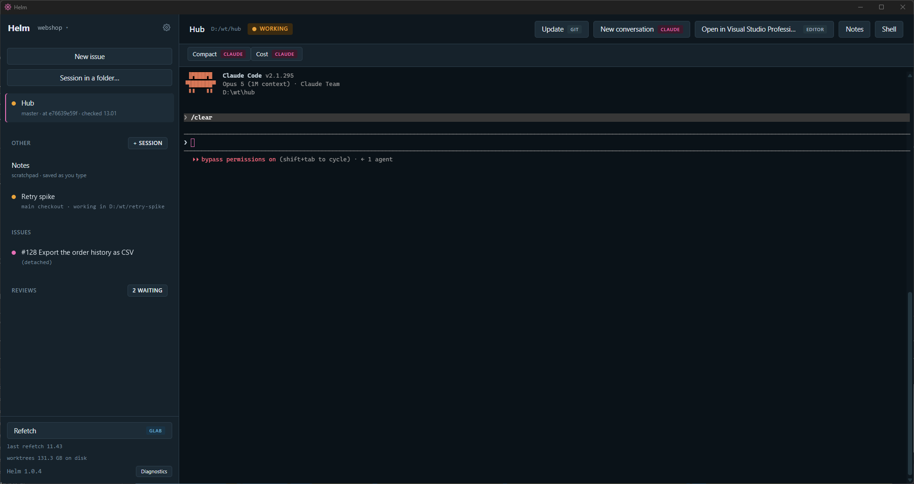
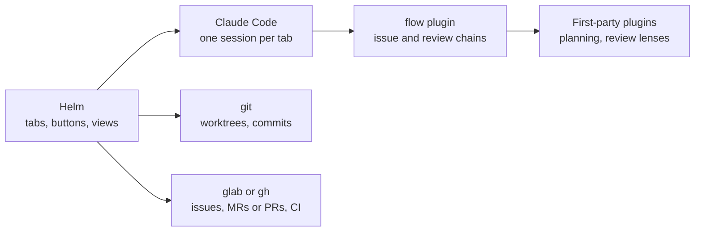

# Helm

A desktop app for issue-driven work with [Claude Code](https://docs.anthropic.com/en/docs/claude-code).
One tab per issue, each a live Claude session in its own git worktree, with
the plan, the commits and the reviews one click away. Works with GitLab and
GitHub, on Windows and macOS.

Every button says what it costs: one tagged **claude** types into the
session and spends tokens; every other tag (**git**, **glab**, **gh**,
**file**, **editor**, **build**) runs on your machine and spends none.

This repository holds the latest installers and these instructions.

## What it does

### Issues

1. **New issue.** Paste an issue link or type its number. Helm shows the
   worktree and branch it will create.
2. **Start.** Helm makes the worktree and branch, runs your configure
   command in the background, opens a Claude tab and types
   `/flow:start-issue`.
3. **Approve the plan.** Claude researches, plans and stops. **Plan** shows
   the plan as a document with its diagrams drawn, a reply box and
   **Approve plan**.
4. **Watch it work.** Tests first, then the implementation, a fresh-context
   review, the build and the formatter. The timeline above the terminal
   shows the step it is on, and steps that were skipped show as done.
5. **Approve the commits.** **Review commits** shows the branch commit by
   commit. Mark lines and send your notes back as one message, or approve
   and let Claude open the merge or pull request.
6. **Clean up.** Once it is merged, **Refetch** offers to remove the
   worktree, the branch and the tab.

### Reviews

The **Reviews** queue lists the merge or pull requests waiting on your
review. **Start review** checks the branch out in its own worktree and
starts a review on it, with a note of your own to steer it if you want one.

Nothing is posted yet. **Review comments** shows Claude's comments on the
diff, each under the lines it is about, with a severity from 1 (a nit) to 5
(must not merge) that only you see. Edit, delete or add your own, then
**Post** sends them as drafts: draft notes on GitLab, a pending review on
GitHub. Nobody sees them until you submit the review.

### Run Debug

**Run** builds the branch of the tab you are on and starts the program you
choose, without opening your IDE. The arrow beside it picks another target,
builds only, or stops what is running. If the build fails, its output opens
and **Send errors to Claude** hands the error lines to that tab's session.
The build command and the targets are set per repository in Settings.

### Around the edges

- A status dot per tab: amber while Claude works, magenta when it wants an
  answer, with one notification.
- A **Hub** tab on the default branch for questions about the codebase,
  plain sessions in any folder, and notes per tab.
- CI status per merge or pull request in the rail.
- Several repositories, each with its own settings and tabs, switched from
  the name beside the logo.
- **Diagnostics** at the foot of the rail says what Helm found on the
  machine, with a Copy button.

## How it fits together

Helm is the window. The work happens in Claude Code, driven by the
[`flow` plugin](https://github.com/MarkusVGJensen/flow), which uses
Anthropic's own plugins for planning and review. What is particular to your
project lives in its `CLAUDE.md` and a small config file, not in Helm.

## Install

The easiest way is to let Claude set everything up. With Claude Code
installed, say:

> Set up Helm on this machine by following
> https://raw.githubusercontent.com/MarkusVGJensen/helm-releases/main/SETUP.md

Claude installs the tools, the plugins and Helm, and writes the config. You
log in when it asks and answer its questions about your project.
[SETUP.md](SETUP.md) is the same guide, readable by a person too.

To install Helm by hand, open the
[latest release](https://github.com/MarkusVGJensen/helm-releases/releases/latest):

- **Windows (x64):** download `Helm_<version>_x64-setup.exe` and run it. It
  is not code-signed, so SmartScreen may say it "protected your PC": choose
  **More info › Run anyway**.
- **macOS (Apple Silicon and Intel):** download `Helm_<version>_universal.dmg`,
  open it and drag Helm into Applications. It is not notarized, so the first
  launch is blocked: open **System Settings › Privacy & Security** and
  choose **Open Anyway** beside the message about Helm.

## Requirements

- Windows 10 or 11 (x64), or macOS
- [Claude Code](https://docs.anthropic.com/en/docs/claude-code), with a
  subscription or API access
- git and Node.js 20 or later
- A GitLab project with [`glab`](https://gitlab.com/gitlab-org/cli) logged
  in, or a GitHub repository with [`gh`](https://cli.github.com/) logged in
- `gh` for Helm's update check, whichever server your project is on
- The [`flow` plugin](https://github.com/MarkusVGJensen/flow), 0.4.0 or later

## Updates

Helm checks this repository for a newer release at launch and offers to
install it, through `gh`. To update `flow`, use **Update flow** under
Settings › Plugins.

An install older than 1.0.0 looks for updates elsewhere: open **Settings**
(the gear, or Ctrl+,) and set **Update source** to
`MarkusVGJensen/helm-releases`.

## Getting help

Open **Diagnostics** in Helm, press **Copy**, and send that along with what
you were doing.
